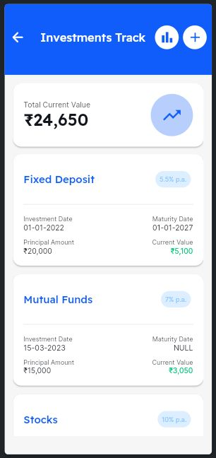

# Infinsa Bot  

## About The Project  
Infinsa Bot is an AI-powered financial inclusion platform developed for **HackZ 2024 Hackathon**, addressing the problem statement:  

> *Develop an AI-powered financial inclusion platform designed for elderly individuals to simplify digital banking and financial planning. The platform should support voice commands, provide timely alerts for financial milestones, and offer tailored scam protection. By addressing digital literacy challenges, this solution aims to enhance independence and promote safe, accessible engagement with financial services for seniors.*  

### Our Solution  
Infinsa Bot is an AI-Powered Mobile App built using **Flutter Flow**, **Python**, and **SQLite**, featuring:  
- **Simplified Digital Banking**: Voice command support for seamless navigation.  
- **Timely Financial Alerts**: Notifications for financial milestones.  
- **Scam Protection**: Educational features to build awareness against phishing.  
- **Senior-Friendly Design**: Intuitive interface with large fonts and buttons.  
- **Visualized Financial Planning Tools**: Interactive graphs for insights.  
- **AI-powered Q&A**: Personalized assistance for financial queries.  

## Built With  
- **Frontend**: Flutter Flow for an intuitive and accessible UI.  
- **Backend**: Python for AI-powered features and data handling.  
- **Database**: SQLite for efficient local storage and user data management.  
- **AI Integration**: Optimized prompts for personalized user interaction.  
- **Security**: Built-in scam protection mechanisms.
- **Haystack**: An open-source framework for building production-ready LLM applications, retrieval-augmented generative pipelines, and state-of-the-art search systems that work intelligently over large document collections.  

## Screenshots

Here are some screenshots showcasing the project:





## Getting Started  
There are two ways to get started with Infinsa Bot:  

### 1. Cloning This Repository  
1. Clone the frontend repository:  
   ```bash  
   git clone https://github.com/MettaSurendhar/Infinsa-App.git
   ```  
2. Clone the [backend](https://github.com/MettaSurendhar/Infinsa-App-server) repository separately:  
   ```bash  
   git clone https://github.com/MettaSurendhar/Infinsa-App-server.git  
   ```  
3. Publish the backend Python code to connect it with the frontend.  
4. Run the Flutter application using your preferred IDE or command-line interface.  

### 2. Cloning Through Flutter Flow  
1. Clone the project directly from Flutter Flow using this link: [Infinsa Bot Flutter Flow Project](https://app.flutterflow.io/project/infinsa-app-cwrubj).  
2. Make any necessary customizations in the Flutter Flow interface.  
3. Connect the backend by publishing the Python backend code. 

## Usage  
Infinsa Bot is available in multiple formats:  
1. **Web Application**: Access the published web app here: [Infinsa Bot Web App](https://infinsa-bot-app.flutterflow.app/).  
2. **Mobile Application**: Download the APK from [apk download](https://github.com/MettaSurendhar/Infinsa-App/releases/download/v0.1.0-alpha/Infinsa.App-release.apk).

### Digital Banking Features:  
- **Account Management**: Track balances and activity.  
- **Credit Card Details**: Monitor transactions and dues.  
- **Loan Management**: Manage repayment schedules.  
- **Investment Tracking**: View portfolios and performance.  
- **Transaction History**: Access detailed transaction logs.  

### Financial Planning:  
- Budget planning, expense tracking, and savings monitoring.  
- Visualized data with interactive graphs for insights into budgets, expenses, savings, and investments.  
- AI-generated budget recommendations and financial health analysis.  

### AI-Powered Assistance:  
- Ask financial questions and receive personalized advice.  
- Plan future investments and savings strategies with AI optimization.  

### Beyond Banking:  
- Stay updated with **Live News & Stock Trends**.  
- Educate yourself on scam protection with phishing simulations and safe practices.  

### Senior-Friendly Design:  
- Larger fonts and buttons for better accessibility.  
- Voice command support for easier navigation.  

## Contributing  
Contributions make the open-source community an inspiring and creative space. We welcome all contributions!  

To contribute:  
1. Fork the Project.  
2. Create your Feature Branch:  
   ```bash  
   git checkout -b feature/AmazingFeature  
   ```  
3. Commit your Changes:  
   ```bash  
   git commit -m "Add some AmazingFeature"  
   ```  
4. Push to the Branch:  
   ```bash  
   git push origin feature/AmazingFeature  
   ```  
5. Open a Pull Request.  

## Top Contributors  
- **[Harini](https://github.com/HariniS1018)**  
- **Adithya**  
- **[Sundar](https://github.com/Sundhar-Balamoorthy)**  

## Acknowledgments  
We express our gratitude to the HackZ 2024 team and organizers for the opportunity to develop Infinsa Bot. Special thanks to the community for inspiring innovation and providing resources to enhance financial inclusion.  
